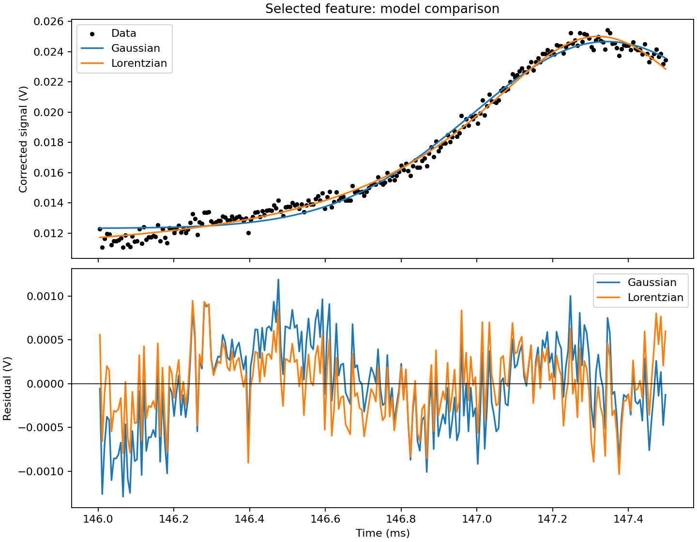

# Physics & Scientific Computing with Python

**Siddharth Prajapati · Engineering Physics · York University**

A growing portfolio of experimental analysis and scientific computing: turning instrument measurements into fitted models, interpretable plots, and quantitative results.

## Featured project: Doppler-free rubidium spectroscopy

[Explore the project](projects/rubidium-spectroscopy/README.md) · [Read the code](projects/rubidium-spectroscopy/src/analyze.py) · [View the notebook](projects/rubidium-spectroscopy/notebooks/lab6-archived.ipynb)



The first project includes **20 original instrument exports**, the lab report, an archived notebook, a portable analysis script, and numerical tests. It reproduces the original Gaussian and Lorentzian time-width fits and documents the remaining calibration and fit-window limitations.

The uploaded report credits ChatGPT with generating the original notebook code. This project presents the work as **AI-assisted experimental analysis**, with original material and later changes documented in its [provenance record](projects/rubidium-spectroscopy/PROVENANCE.md).

## Project index

| Project | Focus | Status |
| --- | --- | --- |
| [Rubidium spectroscopy](projects/rubidium-spectroscopy/README.md) | Background subtraction, nonlinear fitting, residuals, calibration review | Included and reproduced in time units; frequency calibration under review |
| [Gaussian beam analysis](projects/gaussian-beam-analysis/README.md) | Beam profiles, propagation, expansion | Summary ready; original files pending |
| [CMOS image analysis](projects/cmos-image-analysis/README.md) | Image profiles, regions of interest, detector counts | Summary ready; original files pending |
| [Computational physics](projects/computational-physics/README.md) | Fourier methods, ODEs, nonlinear roots, statistical simulation | Collection outline; original files pending |

## Run the first project

From the repository root, using a Python virtual environment:

```bash
python -m pip install -r projects/rubidium-spectroscopy/requirements.txt
python projects/rubidium-spectroscopy/src/analyze.py --output-dir runs/lab6
python -m unittest discover -s projects/rubidium-spectroscopy/tests -v
```

[Environment setup](docs/ENVIRONMENT.md) includes Windows instructions. The original data needed for this run is included. The validated environment is Python 3.12.14, NumPy 2.3.5, SciPy 1.17.0, and Matplotlib 3.10.8.

## Add future work

Each project keeps its source, notebooks, data, figures, and results together. Create another project from the bundled template:

```bash
python scripts/new_project.py pid-control-analysis --title "PID Control Analysis"
```

The utility prepares folders and a notebook outline; add your implementation and a row in the project index.

## Guides

- [Getting started](START_HERE.md)
- [Import existing lab work](docs/IMPORT_EXISTING_WORK.md)
- [Add another project](docs/ADDING_PROJECTS.md)
- [GitHub setup](docs/GITHUB_SETUP.md)

The repository structure, documentation, and supporting utilities were prepared with AI assistance. Authorship and subsequent changes are recorded per project.
