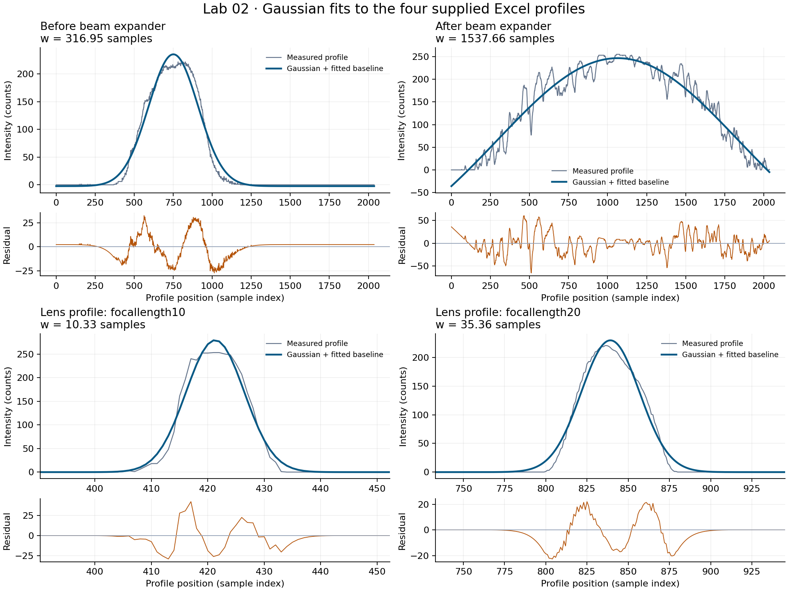
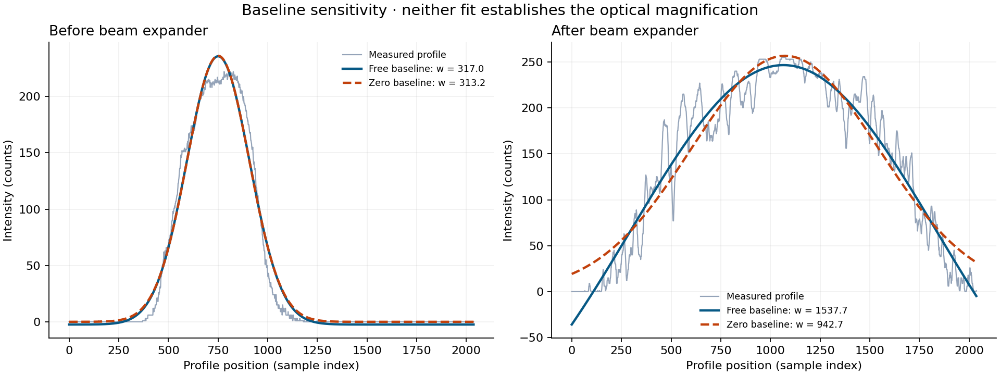

# Lab 02 · Gaussian beam analysis

**Python · NumPy · SciPy · Matplotlib · Excel data import**

How does a laser beam's transverse intensity profile change with focusing and a beam expander? This project fits Gaussian intensity profiles, examines residuals, and shows how assumptions about the background affect inferred beam widths.

[Read the Python code](src/analyze.py) · [Run the notebook](notebooks/analysis.ipynb) · [View the original report](reports/lab2-original-report.docx) · [Browse the images](data/GALLERY.md)



## What is included

The project preserves **20 uploaded files**: four Excel profiles, 14 PNG images, the lab report, and an archived notebook adapted to remove computer-specific paths. A new portable script analyses the four Excel profiles, writes CSV and JSON results, and creates the figures above. Ten tests cover numerical recovery, input integrity, width conventions, and the complete analysis.

The original notebook refers to 13 TXT profiles that were not supplied. Its cached results and report are retained as historical work. The Excel profiles produce different fitted widths, so this run does **not** reproduce those original measurements. See the [data inventory](data/README.md) and [analysis review](ANALYSIS_REVIEW.md).

## Run the analysis

From the repository root, in a Python virtual environment:

```bash
python -m pip install -r projects/gaussian-beam-analysis/requirements.txt
python projects/gaussian-beam-analysis/src/analyze.py --output-dir runs/lab2
python -m unittest discover -s projects/gaussian-beam-analysis/tests -v
```

The script runs without a display and resolves input paths relative to its configuration file. The output directory receives two figures, a summary, a fit table, and four CSV files containing measurements, fitted values, and residuals. Repeating a run replaces these generated files in that directory.

For Jupyter, install `jupyterlab` in the same environment and open [analysis.ipynb](notebooks/analysis.ipynb). The notebook calls the same analysis functions as the command line. [Environment setup](../../docs/ENVIRONMENT.md) includes Windows commands.

## Results from the supplied Excel files

The model is

$$I(x)=A\exp[-2(x-c)^2/w^2]+b,$$

where $w$ is the **1/e² radius above the fitted background**, the diameter is $2w$, and the FWHM is $w\sqrt{2\ln 2}$. The main fit estimates the constant background $b$ freely while constraining the amplitude and radius to be positive.

| Input | Samples | Radius (sample units) | Conditional standard error | Residual RMS (counts) |
| --- | ---: | ---: | ---: | ---: |
| `beforeexpander.xlsx` | 2,038 | 316.95 | 1.28 | 10.26 |
| `expander.xlsx` | 2,037 | 1537.66 | 38.34 | 20.91 |
| `focallength10.xlsx` | 1,021 | 10.33 | 0.05 | 3.14 |
| `focallength20.xlsx` | 2,035 | 35.36 | 0.12 | 3.08 |

Widths are reported in sample units, nominally pixels. The report states 3.2 µm per pixel, but the camera manual and sampling settings are absent, so physical radii are not calculated automatically. The lens filenames suggest 10 cm and 20 cm focal lengths; that association is not verified by acquisition metadata.

### Why the beam-expander result needs care



The expanded profile has **21 samples at 255 counts**, consistent with clipping at an assumed 8-bit ceiling. The freely fitted background becomes strongly negative, and the fitted 1/e² radius extends beyond the measured interval. The diagnostic after/before width ratio is **4.85** with a free background and **3.01** with the background fixed at zero. This large dependence on the model prevents a reliable optical-magnification claim.

The archived notebook reports **2.63 ± 0.06** from different, unavailable TXT profiles. The report's nominal lens design gives **100/25.4 ≈ 3.94×**. These are three distinct pieces of information: a historical fit, a nominal design, and a new analysis with unresolved limitations.

All quoted fit standard errors come from residual-scaled covariance. They exclude systematic model error, saturation, correlated image noise, and spatial-calibration uncertainty. A fitted transverse radius is not automatically the minimum beam waist along the propagation axis.

## Python work demonstrated

- Importing and validating numerical Excel data without dropping the first sample.
- Gaussian fitting with positive widths and reproducible initial estimates.
- Calculating radius, diameter, FWHM, and conditional uncertainty propagation.
- Inspecting residuals, clipping, measurement coverage, and baseline sensitivity.
- Producing figures and machine-readable results through a command-line interface.
- Recording source hashes and testing recovery from known noisy profiles.

## Original work and authorship

The supplied notebook and report document Siddharth Prajapati's lab work. The Lab 02 files do not specify original code authorship or AI assistance. The portable refactor, new notebook, tests, and portfolio documentation were prepared with AI assistance. See [PROVENANCE.md](PROVENANCE.md) for the exact changes.

References: [Newport's Gaussian beam radius convention](https://www.newport.com/n/gaussian-beam-optics) and [SciPy's curve-fit covariance documentation](https://docs.scipy.org/doc/scipy/reference/generated/scipy.optimize.curve_fit.html).
