# Original Lab 02 images

These are the 14 uploaded PNG files, preserved without alteration. Filename order does not establish propagation distance or acquisition order.

## expander.png

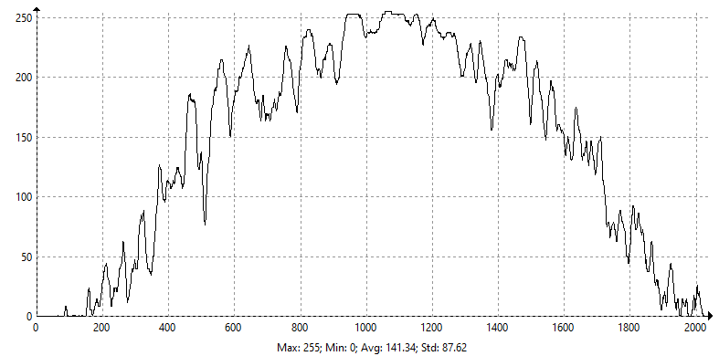

## expanderbeam.PNG

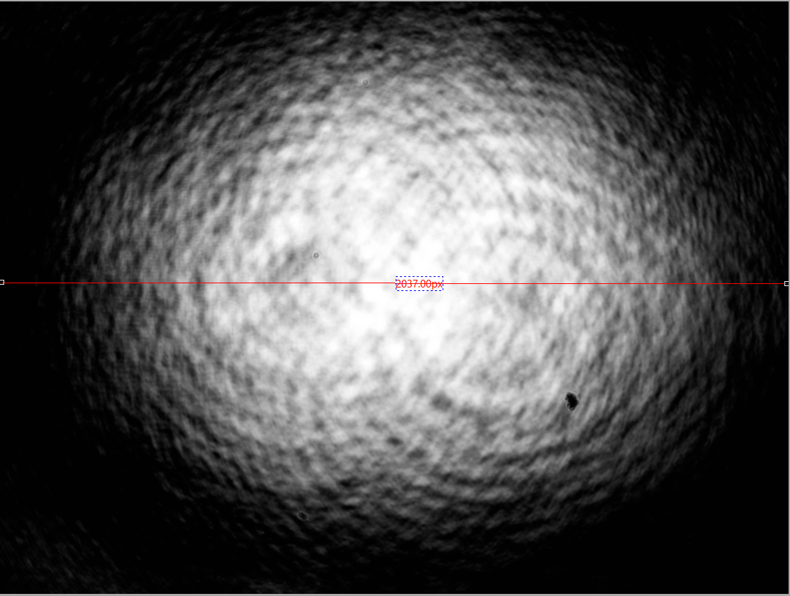

## focallength10.png

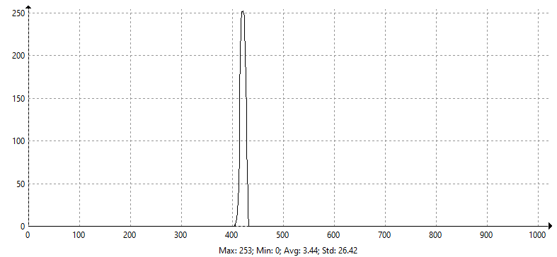

## focallength20.png

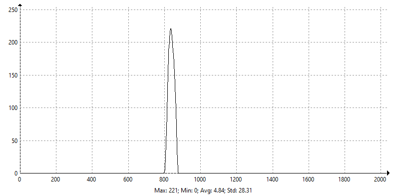

## image1.png

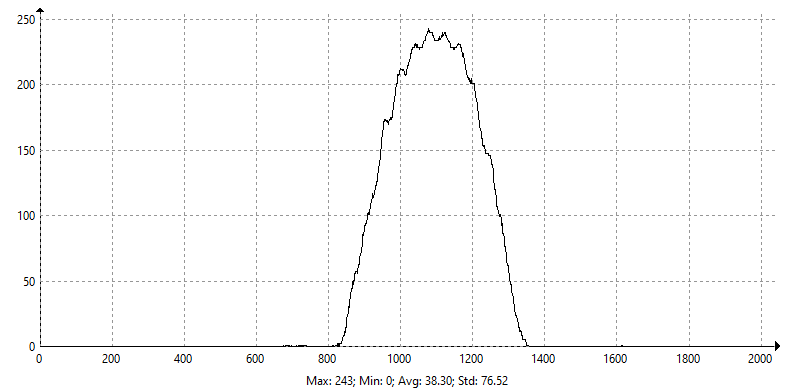

## image2.png

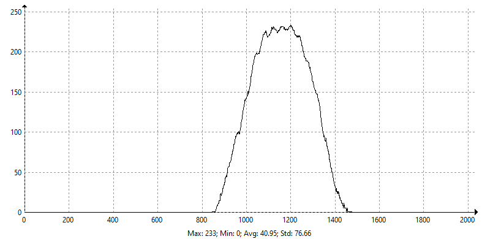

## image3.png

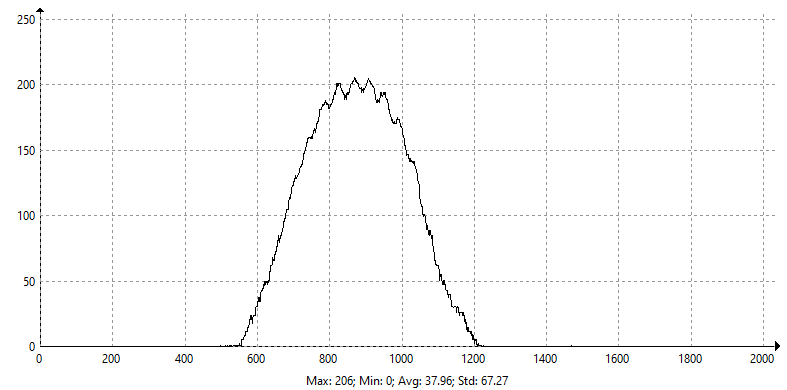

## image4.png

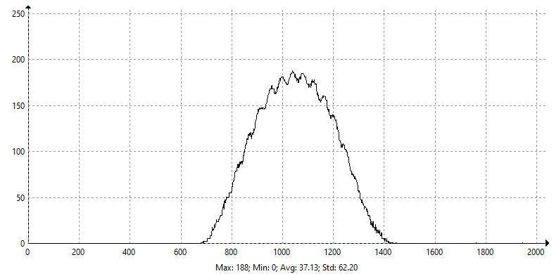

## image5.png

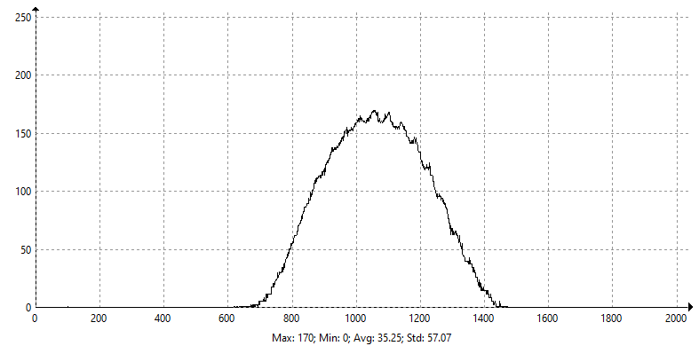

## imagebeforeexpander.PNG

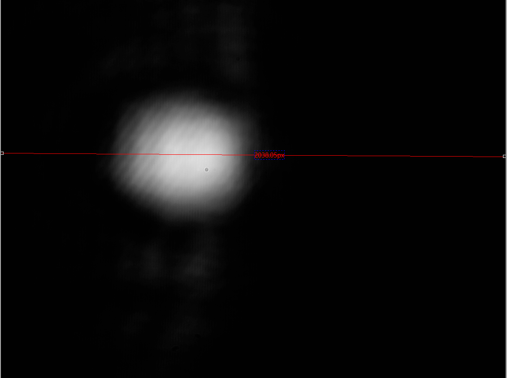

## imageofbeam1.PNG

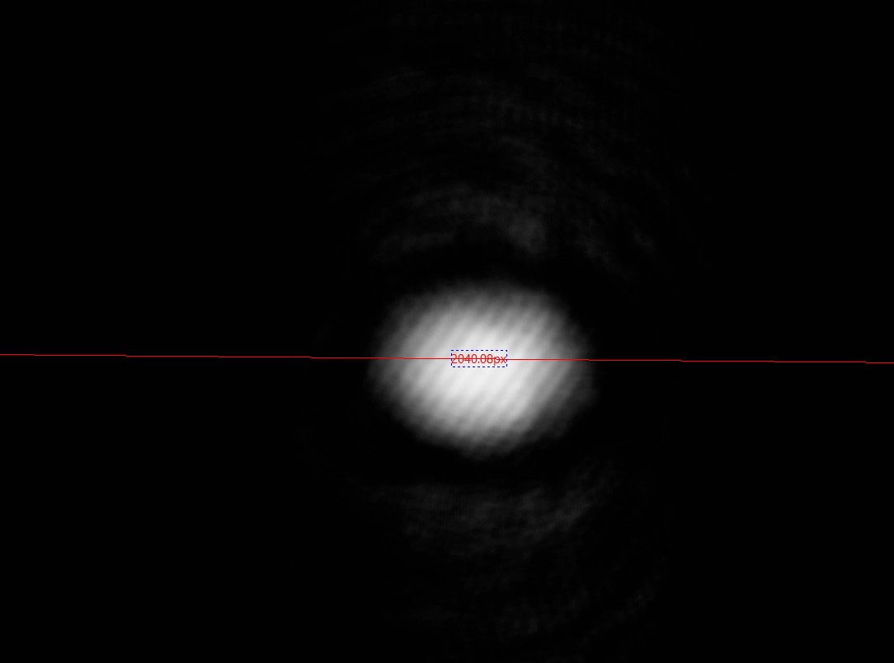

## imageofbeam2.PNG

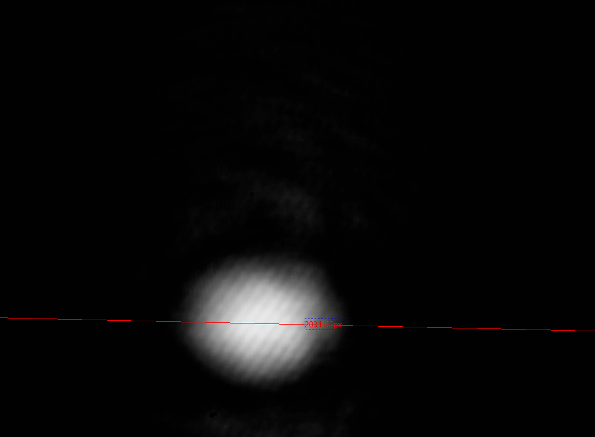

## imageofbeam3.PNG

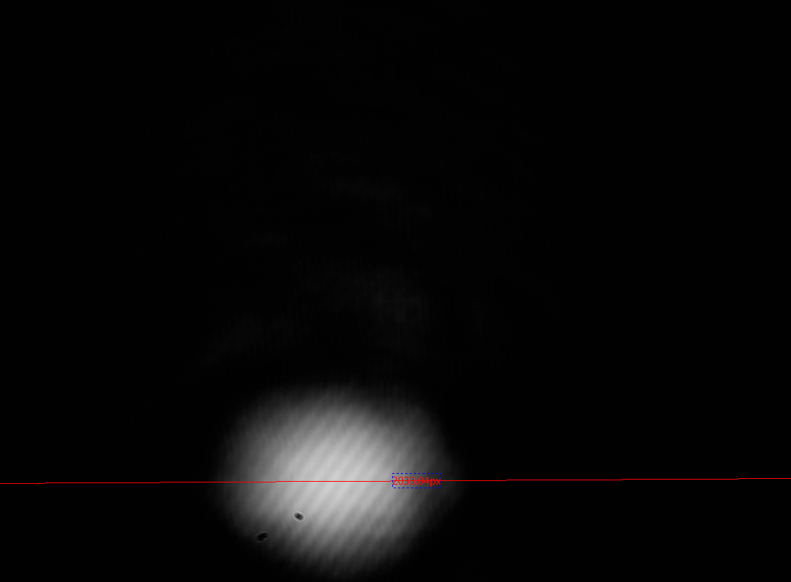

## imageofbeam4.PNG

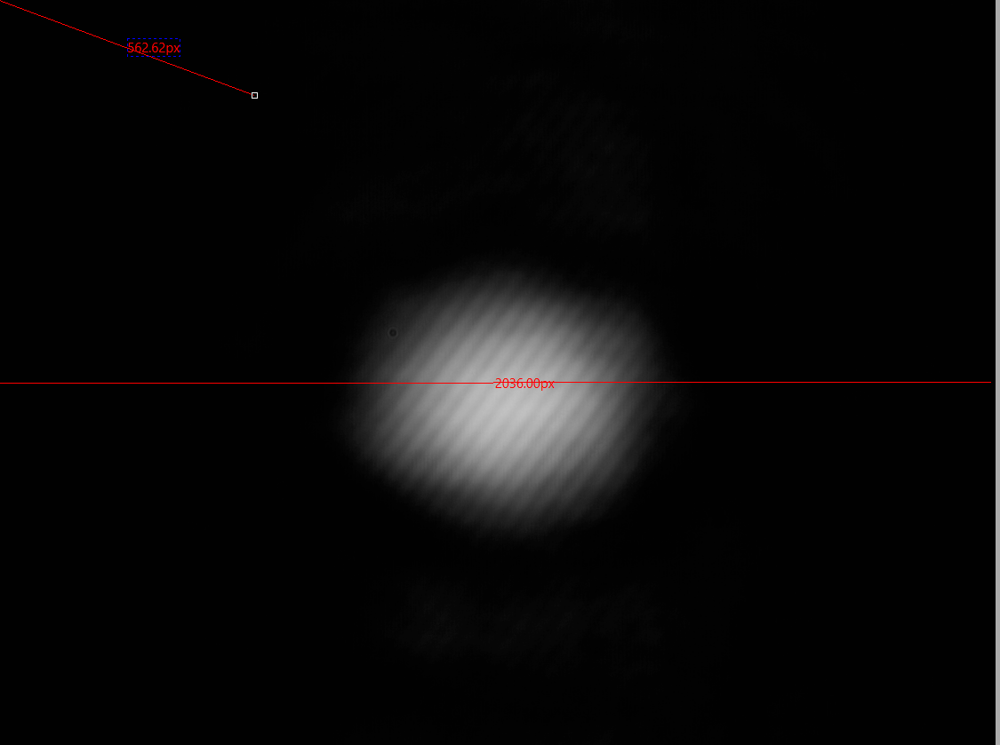
