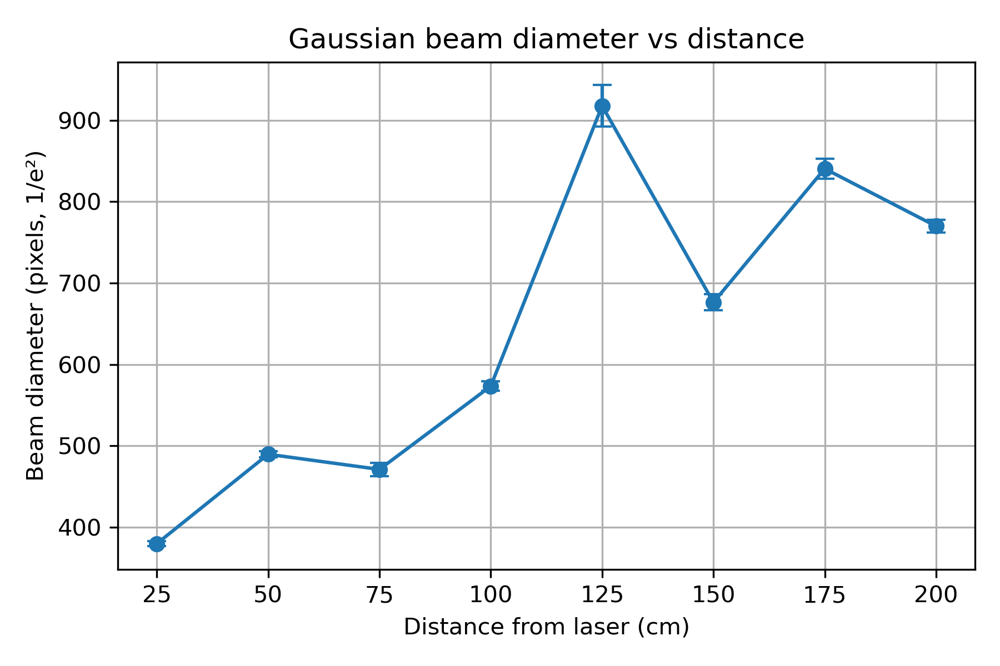

# Historical notebook results

[reported-results.json](reported-results.json) transcribes the cached numerical output of the uploaded notebook. These values were **not recalculated**: the 13 original TXT profiles are unavailable. The original report repeats these results and adds physical conversions using a stated 3.2 µm/pixel scale.

The figure is an unchanged extraction of `word/media/image9.png` from the supplied report. Refer to the [analysis review](../../ANALYSIS_REVIEW.md) before interpreting the historical fits or conclusions.
